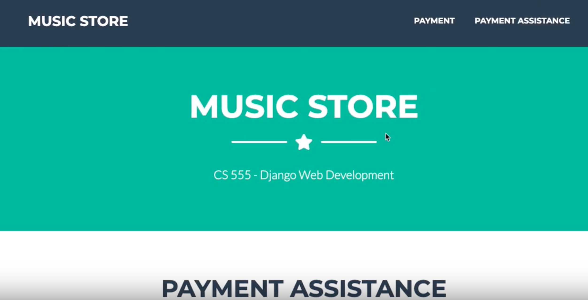

## Music Store - Django

This App shows basic CRUD operations using Django.

## Technologies
- Python 3.7.1
- Django 2.2.6

Lessons learned:
- Install pip package
- Setup a virtual Python environment
- Setup the working environment for Django
- Setup dotenv
- Create Django projects
- Setup Bootstrap Theme
- Configure URLs for Django
- Create apps in Django
- Create templates
- Create regular expressions for URLs
- Use URL parameters, URL extra options, and query strings
- Manage urls using a consolidation approach
- Use namespace in Django
- Create view method requests
- Create middleware
- Use view method alternatives
- Enable variable validation for templates
- Create reusable templates
- Create custom context processors
- Perform Python logic inside templates
- Set up static web page resources
- Debug Django with Django Debug Toolbar
- Debug Django with PDB (Python Debugger) commands
- Create form fields using helper methods
- Create a granular form by field
- Create custom validators for fields
